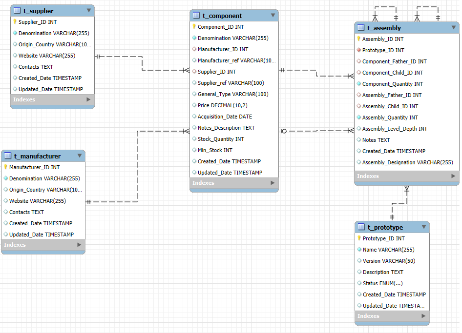

# Pikachu - blkpd-dev branch 

**Base de Dados:**

**TODO**

- Fazer constraints no SQL para alterar entre assemblies atómicas, compostas, ou mixed
- Cada assembly devia ter um nome (ou ID) específico em vez de ficar com o nome do protótipo <--
- Level-Depth não está a funcionar -> clarificar o que significa
- Clarificar o que significa Nível Raíz
- Tirar a dúvida se se precisa de duas assemblies para fazer uma nova
- Falta acrescentar as assemblys ao "Resumo da BOM"
---

**DONE**

- tab=bomlist alterado para tab=bomlist/bomlist
- Atributos separados/alterados para a montagem:
    - Child_ID -> Component_Child_ID | Assembly_Child_ID 
    - Father_ID -> Component_Father_ID | Assembly_Father_ID
    - Quantity -> Component_Quantity | Assembly_Quantity
    - Level_Depth -> Assembly_Level_Depth
        -> **Atributos também já alterados em todas as queries necessárias**

- Alterei a interface para ao selecionar uma Montagem, aparecer *"Protótipo Versão - Designação da Montagem"*
- Acrescentei um Tab com a designação da montagem
- Alterei as componentes pai e filho e as montagens pai e filho para não ser obrigatório -> depois acrescentar constraints para garantir que pelo menos dois estão inseridos
- Alterei a função getAssemblies() para também ter a designação das sub-assemblies presentes lá (se houver)
- Agora aparece a respectiva designação da montagem pai e filho em vez dos respectivos IDs na Estrutura de Montagem
- Mudei o nome da variável "Father_Name" para "Component_Father_Designation" (mesmo para a variável do componente-filho) -> query no getters.php também já está em conformidade

